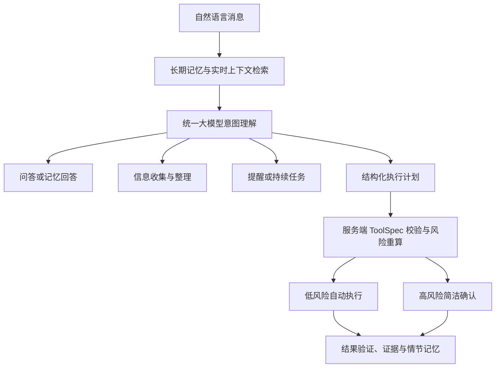

# ADR-0013：R4.6 模型优先对话内核

- 状态：已实施
- 日期：2026-07-17
- 决策范围：自然语言理解、长期记忆检索、任务与提醒、执行规划、设备选择和结果记忆
- 替代范围：ADR-0012 中“执行句式先进入本地 R2 Planner”的路由决策

## 背景

R4.5 使用关键词识别执行消息，再让本地规则 Planner 优先编译。普通问答才进入 Conversation Advisor。这会让“在桌面创建文件夹：动漫”等正常自然语言在到达大模型之前失败，也把路径、工具名和内部能力缺口转嫁给用户。

## 决策

除“继续、暂停、取消、换设备”这类确定性控制命令外，每条普通消息都先进入统一 Conversation Advisor。模型调用同时获得：

- 近期对话历史。
- 按当前消息检索的记忆、任务、知识与活动上下文。
- 服务端注册的 ToolSpec 清单。
- 本机及已登记设备的在线和信任状态。
- 当前时间及桌面、下载、文档等系统位置。

模型只返回结构化 JSON，并选择 `answer`、`memory_query`、`information`、`task`、`execution` 或 `clarify` 之一。`execution` 必须携带结构化计划；`task` 必须携带提醒或持续任务信息。

## 安全边界

- 模型只能选择实际注册的工具，不能决定最终权限或风险。
- 服务端根据 ToolSpec 重新计算权限、风险、确认要求和设备上限。
- 未知工具、非法参数、路径越界、远程权限越界和未登记 Broker capability 仍被阻断。
- 模型不可用或策略禁止时，系统可以使用确定性本地规则降级；本地规则不再是已配置模型时的首选入口。
- 高权限、凭据、不可逆及对外影响动作继续经过 Runtime、审批证明、Broker、watchdog、证据治理和全局急停。

## 持久化结果

- 用户明确要求的提醒直接创建已确认任务，并通过来源引用关联原始消息。
- 用户明确要求“记住”的内容直接形成用户确认记忆；推断内容仍保存为候选。
- 成功执行在首次进入终态时写入 `execution_episode` 情节记忆，关联对话执行和治理后的证据摘要。
- 新会话通过统一搜索恢复相关记忆，而不是依赖模型窗口保存历史。

## 能力补齐

R4.6 同时新增：

- `fs.create_directory`，支持幂等创建、最终状态验证和证据。
- `desktop`、`downloads`、`documents`、`pictures`、`music`、`videos`、`home` 及其中文别名。
- 默认对话界面移除 D0/D1、权限编号和工具选择；内部安全标签仍由服务端自动计算。

## 结果

对话模型成为认知和规划中枢，Runtime 与 Broker 继续作为唯一执行和权限边界。专用 R2 Planner API 保留用于确定性调用和模型不可用降级，但不再拦截已经启用模型的普通对话。
