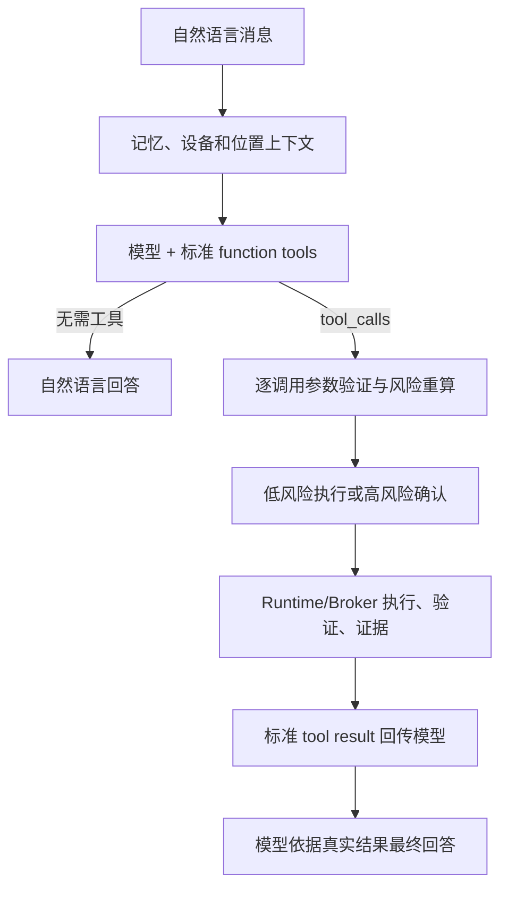

# ADR-0014：R4.7 模型原生工具调用

- 状态：已实施
- 日期：2026-07-17
- 决策范围：普通对话、工具发现、工具选择、执行结果回传
- 替代范围：ADR-0013 中要求模型输出 `intent + execution_plan` 私有 JSON 的决策

## 背景

R4.6 虽然让普通消息先经过大模型，但仍把模型当成私有计划 JSON 生成器。模型必须猜测 `execution_plan.steps.expected_output` 等后端结构，字段类型稍有偏差就会在执行前失败。这不是 Agent 工具调用，而是脆弱的文本编译协议。

## 决策

普通对话使用 OpenAI-compatible Chat Completions 的原生 `tools` 和 `tool_calls` 协议：

1. 服务端把每个已注册 Runtime ToolSpec 转换成 function tool。
2. function 的 `parameters` 直接来自工具输入 JSON Schema。
3. description 同时声明工具用途、权限、风险、副作用、审批、幂等、超时和输出 Schema。
4. 模型自行决定直接回答、调用一个工具或调用多个工具，并自行生成参数。
5. 服务端不信任模型给出的风险判断；每个 tool call 仍由 Runtime Policy、审批、Broker 和路径/网络验证器重新裁决。
6. 工具输出由工具自身验证，不再要求模型生成 `expected_output`。
7. 执行终态的真实 tool result 使用标准 assistant tool call + tool result 消息回传模型，由模型生成面向用户的最终答复。

## 安全边界

- function name 只是模型协议标识，服务端映射回内部 ToolSpec 名称；未知名称一律拒绝。
- 参数必须是 JSON 对象，并再次通过工具 Validator、允许根目录、网络策略和权限上限验证。
- 模型不能设置或降低工具权限、风险、审批要求和 Broker capability。
- 工具结果发送模型前继续应用数据策略和内容治理；策略不允许时使用本地结果摘要。
- 模型最终回复不构成执行证据；Runtime 的调用记录、验证结果和证据制品仍是事实来源。

## 兼容性

专用 R2 Planner API 只保留给显式确定性 API 和已有执行的控制恢复。普通对话不再使用关键词规划降级，也不再把模型文本中的旧私有 JSON、`task_action` 或候选字段解释为动作；只有标准 `tool_calls` 能创建新的任务、记忆或执行计划。
