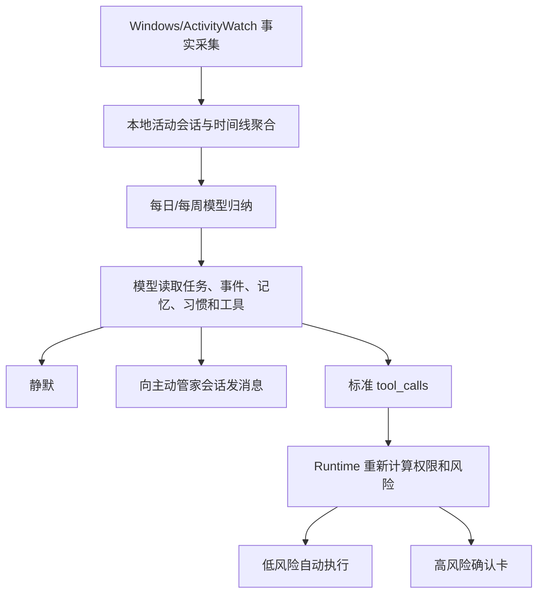

# ADR-0015：R4.8 模型主动管家内核

- 状态：已实施
- 日期：2026-07-17
- 决策范围：真实活动采集、日/周归纳、主动互动、主动工具调用
- 替代范围：S4 基于固定触发条件生成建议的自主决策路径

## 背景

S4 已有到期任务、陈旧任务、事件跟进等固定规则，但它只能证明系统会按预设条件生成候选，不能让模型结合用户近期活动、长期记忆、习惯、任务和日程独立判断是否值得打扰或帮助用户。另一方面，ActivityWatch 和 Screenpipe bridge 默认关闭时没有真实活动输入，习惯和画像管道也不会产生结果。

## 决策

R4.8 将主动决策拆成三个边界明确的阶段：

1. **本地事实采集与聚合**：Windows 原生采样器每 15 秒记录前台应用、窗口标题和持续时间，不采集键盘内容；可选 ActivityWatch 从 loopback API 导入窗口、AFK 和浏览器扩展提供的网页域名。
2. **模型归纳**：每天 20:00、每周日 20:00 对本地聚合的 D2 活动、习惯、洞察、任务、事件和长期记忆进行模型归纳。原始 D3-D6 内容不进入该上下文。
3. **模型主动决策**：模型可以回复 `[SILENT]`、向“主动管家”会话发送自然语言消息，或通过标准 `tool_calls` 选择一个或多个已注册工具。没有固定业务规则把某类事实映射成提醒或任务。

## 安全边界

- 活动采集仍受 collector 开关、数据策略、D5 凭据阻断、加密和保留期治理。
- 主动归纳仅使用 D0-D2 数据，来源策略为 `proactive:*`，发送前再次进行凭据文本清理。
- 模型不能修改 ToolSpec 的权限、风险、副作用、审批和设备上限。
- 模型文字不是执行证据；只有 Runtime/Broker 的验证结果和证据制品可以证明动作完成。
- 主动触发的高风险工具调用与普通对话相同，必须经过确认卡、Broker、watchdog 和全局急停。
- 系统触发提示以隐藏的 `system` 消息关联执行，不出现在用户对话历史中。

## 迁移

- `event-follow-up-candidate`、`stale-open-task-review`、`event-knowledge-summary`、`due-task-reminder`、`sync-conflict-diagnostics` 和 `high-risk-guardrail` 规则统一停用。
- 高风险阻断不是被删除，而是由 Runtime/Broker 强制安全层承担。
- 原 S4 API 和历史记录保留只读兼容，但后台 `autonomy` 规则循环不再承担主动决策。

## 运行参数

- `STEWARD_ACTIVITY_SAMPLE_INTERVAL`：Windows 原生活动采样间隔，默认 `15s`。
- `STEWARD_PROACTIVE_INTERVAL`：检查日/周归纳是否到期，默认 `5m`。
- `STEWARD_PROACTIVE_DAILY_HOUR`：每日归纳本地小时，默认 `20`。
- `STEWARD_PROACTIVE_WEEKLY_DAY`：每周归纳星期，Go weekday 数值，默认 `0`（星期日）。
- `STEWARD_PROACTIVE_WEEKLY_HOUR`：每周归纳本地小时，默认 `20`。

## 验收标准

- `/api/steward/agent` 显示 `activity-sample` 和 `proactive` 循环持续成功。
- `/api/steward/activity/observations` 能看到真实 `collector:windows-activity` 或 `adapter:activitywatch` 记录。
- `/api/steward/proactive/runs` 返回每日/每周归纳、模型、决策和审计引用。
- 模型选择静默时不创建消息或任务；选择工具时必须形成受治理执行。

