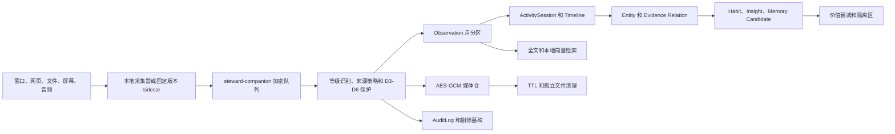

# 私人智能管家自动记录、关联记忆与信息生命周期

## 1. 文档目的

本文是全域自动记录、证据关联、习惯推断和数据清理的实现基线。它定义数据进入系统后的层级、保护规则、聚合周期、接口和当前实现边界。

核心原则：

- 原始证据、活动事实、系统推断、长期资产和审计证据分层保存。
- 所有长期推断都必须能回到观察、来源引用或关系证据。
- D5 凭据先被识别并提升到 D5，默认在 companion 和主服务拒绝；只有两层采集授权和中央外发授权均显式开启时才允许处理。
- 用户输入、用户确认数据和正式任务不参加自动删除。
- 自动清理只能执行已经预授权的保留策略；要求预览的策略必须由用户手动确认。

## 2. 当前实现范围

当前代码已经实现：

- `steward-companion` 用户态缓冲进程，加密 SQLite 行、WAL 和 100,000 条硬上限。
- PostgreSQL 月分区观察表、活动会话、实体、关系、证据、习惯、洞察、保留策略、生命周期运行和删除墓碑。
- AES-256-GCM 原始媒体仓，随机文件路径，数据库只保存元数据和密钥引用。
- PostgreSQL 全文检索；检测到 pgvector 后启用 768 维本地摘要向量和 HNSW 索引。
- 实时去重和 heartbeat 合并、活动会话聚合、习惯和自动化建议、记忆候选。
- 小时、日、周、月、季度生命周期任务和手动 dry-run/purge。
- Screenpipe、ActivityWatch 本地适配器和可选本地 Presidio 脱敏。
- D0-D6 数据策略、A0-A9 权限策略、模型发送队列和结构化高权限工具执行器。
- 工作台中的活动、关系证据、习惯、洞察、生命周期、自动化策略和保留策略视图。

当前代码不内置 Screenpipe、ActivityWatch 或 Presidio 二进制，也不在 companion 内自行实现录屏、OCR 或录音。启用深度采集时，必须安装并固定受信 sidecar 版本，再由本项目适配器导入。

## 3. 数据流



典型证据链：

```text
截图/OCR -> 窗口观察 -> 项目活动会话 -> 时间线片段
          -> 重复行为 -> 习惯候选 -> 自动化建议或记忆候选
```

## 4. 分层存储

| 层级 | 实现 | 保存内容 | 默认清理规则 |
|---|---|---|---|
| 用户态缓冲 | SQLite WAL，字段 AES-GCM 加密 | 尚未提交的 Observation JSON | 成功提交即删除，最多 100,000 条 |
| 原始证据 | `steward_observations` 月分区 | 窗口、网页、文件、OCR、剪贴板等观察摘要 | 按来源 TTL |
| 原始媒体 | `steward_encrypted_blobs` + 随机密文文件 | 截图、音频和大正文 | 按来源 TTL，孤立文件每日清理 |
| 活动事实 | `steward_activity_sessions`、Timeline | 去重聚合后的活动会话 | 可压缩、归档，不随原始媒体立即丢失 |
| 证据图谱 | `steward_entities`、`steward_relations`、`steward_relation_evidence` | 实体、类型化关系及证据 | 证据删除后重新计数，无证据关系标为 stale |
| 系统推断 | `steward_habits`、`steward_insights` | 习惯、阻塞、重复操作和建议 | 价值衰减，先隔离再删除 |
| 长期资产 | Memory、Knowledge、Task、Intent | 用户确认事实、知识、任务、决策 | 不自动删除 |
| 审计 | AuditLog、lifecycle run、tombstone | 授权、外发、阻断、清理和自主行为 | 普通 1 年，高风险 3 年，墓碑 90 天 |

SQLite 使用应用层字段加密，不宣称整个数据库文件是 SQLCipher 容器。数据库结构和 WAL 格式仍属于本机受保护文件；敏感观察正文只以 AES-GCM 密文出现。

## 5. 数据等级与安全

### 5.1 D5 默认阻断和显式授权

内置规则检查私钥、常见云和代码托管凭据、JWT、Cookie 头、凭据赋值和高熵令牌。命中后，无论来源声明什么等级，都会先提升为 D5。默认配置下：

- companion 不写 SQLite，因为默认白名单不包含 D5。
- 主服务的 D5 全局策略为 `collect=deny`、`model=deny`、`allow_local_persistence=false`。
- 审计只记录通用阻断原因，不记录命中的原文。

要允许某个 D5 来源，必须同时完成：

1. companion 的 `STEWARD_COMPANION_COLLECT_DATA_LEVELS` 包含 `D5`；不经过 companion 的本地采集器可跳过此项。
2. 中央 D5 来源策略设置 `collect_mode=auto` 且 `allow_local_persistence=true`，系统会强制本地 AES-GCM 加密。
3. 如需发送模型，D5 来源策略还需 `model_mode=auto`，A6 的 `model:observation` 或 `model:conversation` 策略需允许，且 `STEWARD_LLM_MAX_DATA_LEVEL` 至少为 `D5`。

这些开关相互独立。只修改模型最高等级不会绕过采集策略，只修改 D5 采集也不会自动外发。

### 5.2 D3/D4 处理

- D4-D6 观察 payload、对话消息和对话候选必须使用 `STEWARD_LOCAL_ENCRYPTION_KEY` 做 AES-GCM 静态加密。
- D4 原始媒体只写入加密媒体仓。
- 搜索使用本地脱敏摘要和本地生成向量；是否把 D4-D6 的元数据、摘要、脱敏内容或原文交给模型由来源策略独立决定。
- 配置 `STEWARD_PRESIDIO_URL` 后，D3 及以上文本先交给回环地址上的 Presidio；服务不可用时失败关闭。
- Presidio 只做第二层 PII 识别，不能替代内置 D5 硬阻断。

## 6. 实体、关系与证据

实体类型包括 `user`、`person`、`project`、`application`、`device`、`file`、`repository`、`website`、`topic`、`location`、`meeting`、`goal` 和 `activity`。

关系类型包括：

- `derived_from`
- `belongs_to`
- `occurred_in`
- `mentions`
- `supports`
- `contradicts`
- `precedes`
- `follows`
- `repeats`
- `supersedes`

关系不能脱离证据独立存在。确定性上下文和显式实体提示可直接建立证据关系；模型推断必须先以候选状态保存。删除观察时，其关系证据和全文/向量记录随之失效，关系证据数重新计算，零证据关系进入 `stale`。

检索顺序是：

1. 数据等级、类型、时间和状态过滤。
2. `tsvector + GIN` 全文检索。
3. pgvector 可用时执行本地向量相似度检索。
4. 对命中实体做一跳关系扩展，并按置信度、证据数、时间和用户反馈重排。

## 7. 聚合和价值评估

### 7.1 周期

| 周期 | 处理 |
|---|---|
| 实时 | 指纹去重；同窗口、URL、OCR 或上下文在 5 分钟内合并 heartbeat |
| 每小时 | 关闭并聚合活动会话，创建时间线、实体和关系证据 |
| 每天 | 执行原始 TTL、孤立媒体检查和索引维护 |
| 每周 | 评估重复活动、习惯、洞察和记忆候选 |
| 每月 | 记忆反省，降低长期未验证系统记忆置信度 |
| 每季度 | 归档 180 天未出现的低频项目、仓库和主题实体 |

所有周期任务在 `steward_lifecycle_runs` 中记录状态，并按周期门禁防止重复运行。

### 7.2 价值公式

```text
value =
  0.20 * 用户使用
+ 0.20 * 可行动性
+ 0.15 * 重复出现
+ 0.15 * 独特性
+ 0.15 * 置信度
+ 0.10 * 多来源支持
+ 0.05 * 时间新鲜度
- 0.20 * 信息冗余
- 0.15 * 敏感保存成本
```

分数限制在 `0-1`：

- `>= 0.70`：热数据，可创建记忆候选。
- `0.45-0.70`：正常保留，等待新证据。
- `0.25-0.45`：归档或只保留摘要和关系。
- `< 0.25`：系统推断进入 30 天隔离区，无新证据后删除。

价值分只决定保存和排序，不能提升权限、取消审批或直接触发高风险动作。

## 8. 清理边界

可由已授权策略自动处理：

- 到期剪贴板、截图、音频和活动观察。
- 重复观察、无内容 OCR 和孤立密文媒体。
- 被更高质量事实替代的未确认系统推断。
- 长期无证据、未确认且未锁定的习惯或洞察。

绝不自动删除：

- 用户手动输入和手动导入知识。
- 用户确认的记忆、意图、习惯和洞察。
- 正式任务、项目决策和保留锁数据。
- 有活动任务或未解决冲突的数据。
- 权限、模型外发、高风险阻断和删除审计。

`/lifecycle/evaluate` 永远先生成模拟结果。`/lifecycle/purge` 只接受一小时内的评估 ID，重新计算后执行已允许的动作，并返回审计编号。要求预览的策略不会在后台自动执行。

## 9. API

所有路径以 `/api` 为前缀：

| 方法 | 路径 | 用途 |
|---|---|---|
| `POST` | `/steward/activity/observations` | 仅回环来源提交观察 |
| `GET` | `/steward/activity/observations` | 查询原始观察摘要 |
| `GET` | `/steward/activity/sessions` | 查询活动会话 |
| `GET` | `/steward/activity/timeline` | 查询活动时间线 |
| `GET` | `/steward/entities` | 查询实体 |
| `GET` | `/steward/entities/{id}/relations` | 查询一跳关系和证据 |
| `GET/PATCH` | `/steward/habits`、`/steward/habits/{id}` | 查看、确认或忽略习惯 |
| `GET/PATCH` | `/steward/insights`、`/steward/insights/{id}` | 查看、确认或忽略洞察 |
| `GET` | `/steward/lifecycle/status` | 查看分层数量、磁盘、到期和运行状态 |
| `POST` | `/steward/lifecycle/evaluate` | 生成清理模拟 |
| `POST` | `/steward/lifecycle/purge` | 执行已授权评估 |
| `GET/PATCH` | `/steward/retention-policies`、`/steward/retention-policies/{id}` | 查看和修改 TTL 策略 |
| `GET/PUT` | `/steward/automation/data-policies` | 查看和修改 D0-D6 来源策略 |
| `GET/PUT` | `/steward/automation/permission-policies` | 查看和修改 A0-A9 动作策略 |
| `GET/POST` | `/steward/automation/model-dispatches`、`/steward/automation/model-dispatches/run` | 查看和处理模型发送队列 |
| `GET/PUT` | `/steward/automation/tools` | 查看和登记结构化本地工具 |

## 10. Companion 运行

发布目录已包含 `steward-companion`。Windows 默认通过认证 Named Pipe `\\.\pipe\MongojsonStewardCompanion` 接收 Session 工具调用，并把采集数据提交到 `http://127.0.0.1:18080/api`。只有显式传入 `-listen 127.0.0.1:18182` 时才额外开放诊断用回环 HTTP；该监听不绑定外部网卡。

```powershell
# 生成一次 32 字节本地密钥，并同时配置给主服务和 companion
$bytes = New-Object byte[] 32
[Security.Cryptography.RandomNumberGenerator]::Fill($bytes)
$env:STEWARD_LOCAL_ENCRYPTION_KEY = [Convert]::ToBase64String($bytes)
$env:STEWARD_COMPANION_COLLECT_DATA_LEVELS = 'D0,D1,D2,D3,D4,D6'

.\steward-companion.exe `
  -api http://127.0.0.1:18080/api
```

需要兼容旧采集器或通过 HTTP 检查状态时显式增加 `-listen 127.0.0.1:18182`，然后执行：

```powershell
Invoke-RestMethod http://127.0.0.1:18182/status
```

采集器向 companion 提交：

```powershell
Invoke-RestMethod -Method Post http://127.0.0.1:18182/observations `
  -ContentType application/json `
  -Body '{"source":"manual-sidecar","type":"window_activity","summary":"编辑项目文档","data_level":"D2","context_key":"personal-steward"}'
```

主服务不可用时数据留在加密队列；恢复后每 10 秒最多提交 200 条。确认收到 `2xx` 后才从队列删除。

## 11. 采集适配器

- `system-status`：读取设备、平台、CPU 和运行时元数据。
- `watched-directory`：只读已授权目录的文件名、大小和修改时间。
- `screenpipe`：只允许回环 API，必须配置固定 release/commit，键盘内容采集固定关闭。
- `activitywatch`：读取回环地址上的 bucket/event/heartbeat 数据。

Windows/macOS 默认 profile 为 `deep`，Linux 默认为 `light`。可用 `STEWARD_CAPTURE_PROFILE=deep|light` 覆盖。profile 是采集策略和容量提示，不改变 D5、审批或自动清理保护规则。

资源目标：

| 平台/profile | 稳定内存 | 峰值内存 | 默认采集倾向 |
|---|---:|---:|---|
| Windows deep | 4 GB | 8 GB | 屏幕/OCR/STT 和关系分析 |
| macOS deep | 3 GB | 6 GB | 屏幕/OCR/STT 和关系分析 |
| Linux light | 512 MB | 1 GB | 窗口、AFK、浏览器元数据 |

## 12. 配置项

| 变量 | 说明 |
|---|---|
| `STEWARD_LOCAL_ENCRYPTION_KEY` | Base64 编码的 32 字节 AES key，D4、媒体仓和 companion 必填 |
| `STEWARD_LOCAL_ENCRYPTION_KEY_ID` | 当前本地密钥标识 |
| `STEWARD_LOCAL_ENCRYPTION_PREVIOUS_KEYS` | 轮换期旧密钥集合 |
| `STEWARD_CAPTURE_PROFILE` | `deep` 或 `light` |
| `STEWARD_PRESIDIO_URL` | 可选，本地 Presidio 回环地址 |
| `STEWARD_PRESIDIO_MIN_SCORE` | 可选，PII 最小置信度 |
| `STEWARD_PRESIDIO_LANGUAGE` | 可选，默认 `en` |
| `STEWARD_COMPANION_ADDR` | companion 回环监听地址 |
| `STEWARD_API_BASE` | companion 提交目标，必须是回环 Steward API |
| `STEWARD_COMPANION_COLLECT_DATA_LEVELS` | companion 可进入加密缓冲区的独立等级列表；默认排除 D5，`all` 表示 D0-D6 |
| `STEWARD_LLM_MAX_DATA_LEVEL` | 已配置模型可接收的最高等级，支持 D0-D6；仍受数据来源策略和 A6 策略约束 |
| `STEWARD_MODEL_DISPATCH_INTERVAL` | 自动模型发送队列周期，默认 `1m` |
| `STEWARD_MODEL_DISPATCH_LIMIT` | 每轮模型发送上限，默认 20 |
| `STEWARD_AUTONOMY_INTERVAL` | 后台自主扫描与执行周期；默认关闭，设置正 duration 后启用 |
| `STEWARD_AUTONOMY_LIMIT` | 每轮自主候选处理上限，默认 12 |

## 13. 自动采集、模型发送与操作执行配置

工作台 `http://127.0.0.1:18080/steward` 中的“数据采集与模型发送”按 `data_level + source_pattern` 保存规则，更具体的 glob 规则优先于 `*`。例如 `D4 + adapter:screenpipe` 不影响 `D4 + conversation`。

每个 D0-D6 规则有独立字段：

- `collect_mode`：`deny`、`manual`、`auto`。
- `model_mode`：`deny`、`manual`、`auto`。
- `model_content_mode`：`metadata`、`summary`、`redacted`、`raw`。
- `allow_local_persistence`、`allow_sync`、`require_encryption`。
- 可选 `consent_expires_at`，到期规则不会再匹配。

把所有等级全局设为自动采集和自动发送的 API 示例：

```powershell
$api = 'http://127.0.0.1:18080/api'
foreach ($level in 0..6) {
  $body = @{
    data_level = "D$level"
    source_pattern = '*'
    collect_mode = 'auto'
    model_mode = 'auto'
    model_content_mode = 'raw'
    allow_local_persistence = $true
    allow_sync = $false
    require_encryption = ($level -ge 4)
    description = 'user explicitly enabled all-level collection and model disclosure'
  } | ConvertTo-Json
  Invoke-RestMethod -Method Put "$api/steward/automation/data-policies" -ContentType application/json -Body $body
}
```

该示例会允许 D5 原文外发，风险极高。实际配置更适合按来源使用 `summary` 或 `redacted`。此外仍需：

```text
STEWARD_LLM_MAX_DATA_LEVEL=D6
STEWARD_COMPANION_COLLECT_DATA_LEVELS=D0,D1,D2,D3,D4,D5,D6
```

主服务和 companion 修改环境后必须重启。模型观察发送还要求 `A6 + model:observation` 为 `auto`；对话发送要求 `A6 + model:conversation` 不为 `deny`。后台队列默认每分钟处理，也可在工作台手动点击“立即处理”。

操作权限矩阵按 `permission_level + action_pattern` 独立配置：

- `execution_mode`：`deny`、`manual`、`auto`。
- `require_simulation`、`require_rollback`。
- `max_batch_size`：单轮相同权限和动作的最大执行数。
- `cooldown_seconds`：相同动作成功执行后的冷却。

A4-A9 没有通用 shell 后门。必须先在“高权限本地工具”登记 `tool:<name>`，使用绝对可执行路径和固定参数数组，再同时满足：

1. 工具已启用，提案权限和风险不低于工具要求。
2. 对应权限和动作策略允许执行。
3. 自主模式为 `controlled`，全局最高自动权限覆盖该等级。
4. 有规则的后台候选还必须由启用的 `auto` 规则覆盖；工作台“运行一次”会创建显式提案并进入同一执行门禁。
5. 要求模拟或回滚时，执行器必须提供成功模拟和回滚定义。

结构化工具子进程不会继承 `STEWARD_LLM_API_KEY`、本地加密 key 或同步 secret。标准输出和错误最多保留 32 KiB 用于哈希，审计不保存命令输出原文。

## 14. 当前限制和后续实机门槛

- PostgreSQL 环境没有 pgvector 时自动退回全文检索和关系扩展，不阻断主服务启动。
- Screenpipe、ActivityWatch 和 Presidio 需要单独安装并固定版本；第三方服务不可用不影响手动记录、时间线和自主规则。
- companion 当前是独立用户态进程；系统服务安装器只管理主 `steward` 服务，用户会话自启需在各平台显式配置。
- macOS/Linux 已可交叉编译，但深度采集权限、用户会话自启和长时间资源目标仍需在真实设备验收。
- 工作台关系视图当前是一跳证据浏览器，不是大规模力导向图；这避免在证据量增大时把浏览器作为图数据库使用。

## 15. 验证

```powershell
cd backend
go test ./...

cd ..\frontend
npm run build

cd ..
pwsh ./deploy/build-steward.ps1 -Version activity-memory-local -Clean
pwsh ./deploy/verify-steward-dist.ps1 -ExpectedVersion activity-memory-local -RunCurrentBinary
```

端到端验证至少覆盖：D5 零落盘、D4 密文媒体、观察聚合幂等、关系证据、低价值隔离、预览后清理、90 天墓碑和 companion 离线恢复。
