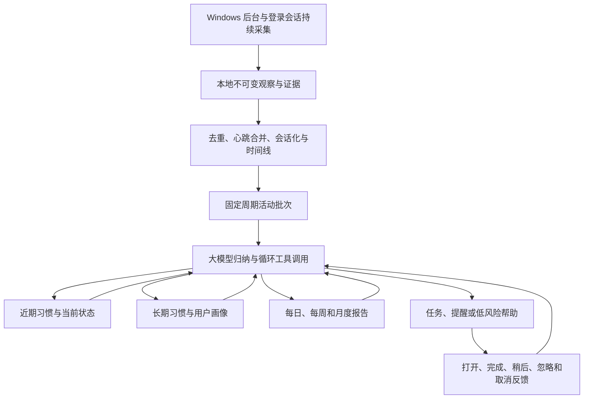
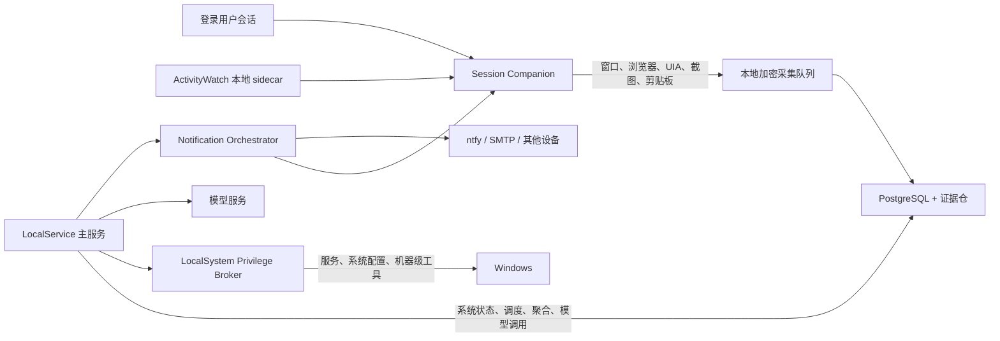

# 私人智能管家持续主动个人智能内核需求文档

本文定义私人智能管家下一阶段的产品与工程目标：在 Windows 上默认常驻采集用户活动，把高频事实先在本地聚合，再周期性地交给大模型归纳；持续维护近期习惯、长期习惯和可追溯用户画像；每天形成活动报告；结合任务、日程、活动状态和历史反馈，自主调整提醒的内容、频率、时间与投递渠道。

本文是 R4.8 主动内核之上的增量需求，暂定为 **R5.3 持续主动个人智能内核**。它继承现有循环 Agent、工具平台、Windows 生产隔离和持久化通知能力，不重新设计底层工具执行协议。

## 1. 产品意图

### 1.1 一句话目标

管家应像一个长期在场、会观察、会复盘、会逐渐了解用户的执行型助理：用户不必反复解释自己做过什么、习惯什么时间工作、哪些提醒有效；系统能从持续活动中形成可纠正的长期理解，并在合适的时机提供真正有用的提醒、总结或低风险帮助。

### 1.2 用户期望的完整闭环



### 1.3 核心产品原则

1. **默认常驻，而不是收到对话才工作**：安装完成后自动启动采集、聚合、归纳、报告和提醒调度。
2. **模型决定业务行为**：模型结合事实、记忆、画像、日程和工具，决定沉默、询问、提醒、创建任务或执行帮助；固定业务规则不替模型判断用户需要什么。
3. **高权限是系统整体能力，不是所有进程都运行在 LocalSystem**：系统级能力由 Broker 承载，交互桌面能力由登录会话 Companion 承载，主服务保持受限账户。这样既能获得完整能力，也避免 Session 0 无法看到真实桌面。
4. **本地先聚合，模型读高价值批次**：原始事实先落本地并会话化，模型默认读取增量摘要和证据索引，不再为每个窗口切换单独调用一次模型。
5. **近期与长期同时存在**：近期状态可以快速变化，长期画像必须缓慢更新；一次偶然行为不能立即成为永久人格结论。
6. **结论必须能解释和纠正**：习惯、画像、报告和提醒决策都能回到来源时间段和证据；用户的纠正立即成为最高优先级事实。
7. **提醒优化帮助收益，不优化点击率**：系统学习何时值得打扰、何时应沉默，并把忽略、推迟和取消视为重要反馈。
8. **无网页也能工作**：采集、模型归纳和系统通知均不依赖 Web 页面保持打开。
9. **允许广泛采集和高权限自动运行**：不使用旧 D0-D6、A0-A9 或风险卡片决定能否采集和归纳。仍保留加密、来源校验、Schema、幂等、进程隔离、Watchdog、证据和全局暂停等技术完整性控制。

### 1.4 关键用户场景

- 用户晚上没有主动询问，管家仍能生成“今天做了什么”的完整报告，并在合适时机通过系统通知提示。
- 用户问“我最近是不是睡得更晚、看剧更多、工作专注时间变了”，管家能比较近期和长期基线，并展开证据。
- 用户多次把上午提醒延后到晚上，管家逐渐把同类提醒移到更容易响应的时段，而不是永远固定延后 30 分钟。
- 用户说“这个判断不对”后，管家能纠正报告、画像和相关提醒策略，后续不再把旧推断当作当前事实。
- 用户几天不打开网页，后台采集、模型归纳、日报、提醒和低风险帮助仍持续运行。
- 用户问“你现在在收集什么、哪些任务在后台运行”，管家读取实时状态后如实回答，而不是根据能力清单猜测。

## 2. 继承关系

本需求复用而不重复下列能力：

- [R4.8 主动内核运行说明](personal-ai-steward-runtime-r4-8.md)：活动采集、每日/每周主动周期和模型主动决策。
- [ADR-0015：R4.8 模型主动管家内核](adr/0015-steward-r4-8-proactive-kernel.md)：事实采集、模型归纳和主动决策三阶段结构。其中旧 D/A 限制不再适用于本需求。
- [ADR-0016：设备所有者模式](adr/0016-steward-device-owner-mode.md)：模型完整上下文与设备所有者运行模式。
- [自动记录、关联记忆与信息生命周期](personal-ai-steward-activity-memory-lifecycle.md)：Observation、ActivitySession、Timeline、Habit、Insight、Evidence 和保留生命周期。只复用其数据分层，不复用旧 D/A 决策逻辑。
- [对话原生私人智能管家产品需求](personal-ai-steward-conversation-native-prd.md)：对话、持久化记忆、主动收集和自主执行的产品入口。
- [ADR-0017：持久化多通道通知](adr/0017-steward-durable-notification-delivery.md)：系统通知、ntfy、邮件、持久投递、重试、去重和交互记录。
- [R5.1 自主补救与事务化系统变更](personal-ai-steward-runtime-r5-1.md)：需要修改操作系统时的真实验证、补救和回滚。

## 3. 当前实现与运行现状

### 3.1 2026-07-19 本机真实运行快照

以下数据来自当前 `main` 代码和本机生产服务，不是设计假设：

| 项目 | 当前事实 | 判断 |
|---|---|---|
| 后台服务 | `MongojsonSteward` 正在运行，主 API 同源托管在 `127.0.0.1:18080` | 已常驻 |
| 采集器 | `activitywatch-bridge`、`windows-activity` 和 `manual-input` 已启用 | 部分可用 |
| ActivityWatch | 实际端点为 `127.0.0.1:6100`，观察持续刷新 | 正在真实采集 |
| 后台循环 | `activity-sample` 15 秒、`collection` 5 分钟、`model-dispatch` 1 分钟、`proactive` 5 分钟、`notifications` 5 秒 | 正在运行 |
| 原始观察 | 约 3395 条 | 已持久化 |
| 活动会话 | 约 2398 条 | 已聚合，但碎片较多 |
| 模型派发 | 完成 2106、阻断 986；最近一小时新增约 307 条 | 过度逐事件调用 |
| 模型洞察 | 2106 条，基本是一条观察对应一条洞察 | 噪音和成本过高 |
| 习惯 | 0 条 | 尚未形成习惯闭环 |
| 任务 | 0 条 | 尚未形成主动任务闭环 |
| 通知 | 0 条 | 尚未形成提醒闭环 |
| 每日主动归纳 | 2026-07-17 成功并选择静默；2026-07-18 因旧 API Key 失败 | 有能力但不可靠 |
| 数据保留 | 一般观察 30 天、时间线 365 天、系统推断 180 天并隔离 30 天 | 已有生命周期基线 |

快照数值会随运行变化；这里用于说明结构性现状，不作为固定容量上限。

### 3.2 已经具备的工程基础

- Daemon 随主服务启动并持久记录循环状态。
- ActivityWatch bridge 可导入窗口、AFK 和浏览器扩展事件。
- Observation、Session、Timeline、Insight、Habit、Memory 和 Evidence 已有数据库基础。
- R4.9 循环 Agent 已支持模型多轮原生工具调用、持久 Episode、恢复、暂停和取消。
- 通知已经具备系统通知、ntfy、SMTP、重试、去重、确认、稍后提醒和取消。
- Windows 已有 LocalService 主服务、LocalSystem Broker 和登录会话 Companion 的生产隔离形态。
- Toolsmith 可以发现能力缺口并创建、测试和热加载工具。

### 3.3 关键缺口

1. **模型派发粒度错误**：当前 owner mode 会让单条活动观察进入 `raw` 模型派发。一小时数百次模型调用产生大量孤立洞察，却没有形成习惯、画像或稳定日报。
2. **交互会话采集路径不统一**：`windows-activity` 在受限主服务内调用 `GetForegroundWindow`；服务位于 Session 0 时无法可靠看到登录用户桌面。当前有效数据主要来自 ActivityWatch，而不是原生采样循环。
3. **习惯算法过于机械**：现有周任务依赖相同 `context_key` 的计数；窗口标题稍有变化就会碎片化，也不能区分近期趋势和长期模式。
4. **没有正式用户画像**：缺少画像快照、字段来源、冲突、版本、近期值、稳定值和变更历史。
5. **没有正式日报实体**：每日 proactive run 可以静默或发一条消息，但不保证每天生成结构稳定、可回看、可比较的报告。
6. **通知反馈没有进入下一次模型判断**：`acknowledge`、`snooze`、`cancel` 等交互虽已存储，但没有被聚合成可打扰时段、频率偏好或渠道偏好。
7. **管家不能可靠回答自身状态**：模型上下文没有注入采集新鲜度、循环状态、最近归纳结果、通知数量等事实，也没有专用自省工具，容易把“能力说明”误答成“当前事实”。
8. **周期任务恢复不足**：某个每日 run 创建后如果进程崩溃，唯一键可能阻止当天重新领取；缺少统一的过期租约、补跑和缺口修复语义。

## 4. 目标架构

### 4.1 进程和权限形态



默认高权限开启的准确含义是：安装后所有必要组件自动启动，主服务可以通过 Broker 调用系统级能力，也可以通过 Companion 访问当前用户会话；不是把主服务、浏览器采集器和所有脚本都直接提升为 LocalSystem。

### 4.2 信息处理流水线

```text
原始事件
  → 来源标准化与幂等写入
  → heartbeat 合并
  → AFK/窗口/网页/文件/任务联合会话化
  → 1～5 分钟本地增量聚合
  → 30 分钟或活动边界形成模型批次
  → 模型归纳、查询记忆、按需取证、调用工具
  → 更新近期状态、稳定画像、报告、任务和提醒策略
  → 收集用户反馈
  → 下一批次重新校准
```

## 5. 默认后台采集基线

### 5.1 启动与运行要求

- **COL-001**：Windows 首次安装成功后，主服务、Broker、Companion 和已安装的本地采集 sidecar 必须自动启动；重启系统和重新登录后自动恢复。
- **COL-002**：采集默认开启，不依赖用户打开网页、发起对话或手动点击“开始”。
- **COL-003**：主服务不可用时，Companion 在本地加密队列继续缓冲；恢复后按游标补交，成功落库后再删除队列记录。
- **COL-004**：每个采集源必须报告 `last_source_event_at`、`last_ingested_at`、游标、积压量、错误和实际会话 ID。循环“运行中”但数据陈旧不得显示为健康。
- **COL-005**：全局暂停和急停必须同时停止新采集、模型外发、主动决策和工具执行；恢复后按各任务的补跑策略继续。

### 5.2 默认采集源

Windows `deep` profile 默认启用：

- 前台应用、窗口标题、进程和活动持续时间。
- AFK、锁屏、登录、睡眠、唤醒和设备在线状态。
- 浏览器当前 URL、标题、域名、标签页切换和下载元数据；由本地浏览器扩展或 ActivityWatch watcher 提供。
- 文件创建、修改、移动、删除和下载元数据；高价值文件按需提取正文或哈希。
- 终端、IDE、Git、构建、测试和本项目 Agent 工具执行摘要。
- 日历、任务、提醒、系统通知和提醒交互。
- 管家对话、Agent Episode、工具结果和执行证据。
- 应用、服务、网络、电量、磁盘和备份等系统状态变化。

深度但高容量的来源采用“事件触发 + 按需取证”，而不是无条件连续录制：

- 窗口或任务上下文显著切换时截图和 OCR。
- 模型无法判断且需要证据时请求截图、文件正文或页面内容。
- 会议或音频总结在检测到已配置的会议应用或明确持续任务时运行。
- 剪贴板只保留短期去重缓冲，提炼出任务、链接或事实后按生命周期清理原文。

这里的限制依据是噪音、存储、性能和模型成本，不是旧的数据等级审批。

### 5.3 ActivityWatch 导入要求

- **COL-010**：按 watcher、host 和 event type 分 bucket 保存独立增量游标。
- **COL-011**：每次读取带小范围重叠窗口并按来源事件 ID/指纹 upsert，因为 heartbeat 会延长或合并既有事件。
- **COL-012**：窗口事件必须与 AFK 事件联合计算，不能把离开电脑期间的前台窗口误算为有效活动。
- **COL-013**：保存原始 UTC 时间、设备时区和摄取时间；跨设备报告按用户当前时区投影。
- **COL-014**：适配器检测本地 API 版本和能力，不把端口 `5600` 写死；端点来自受保护配置。

ActivityWatch 的 bucket、event 和 heartbeat 模型适合作为本地事实流；相邻相同事件应先通过 heartbeat 合并，而不是把每次采样都当作独立高价值事实。参考其[数据模型](https://docs.activitywatch.net/en/latest/buckets-and-events.html)和[本地 REST API](https://docs.activitywatch.net/en/latest/api/rest.html)。

## 6. 本地聚合与周期性模型归纳

### 6.1 调度默认值

| 任务 | 默认周期 | 说明 |
|---|---:|---|
| 交互活动 heartbeat | 5～15 秒 | 仅本地写入和相邻事件合并 |
| 增量会话化 | 1 分钟 | 合并窗口、AFK、网页和关联事实 |
| 常规采集器拉取 | 1～5 分钟 | 依据来源成本配置 |
| 模型活动批次 | 30 分钟 | 可配置为 15～120 分钟 |
| 活动边界批次 | 上下文结束后 5 分钟 | 会议、长专注块、出行等结束时触发 |
| 每日报告 | 自适应晚间时间，默认兜底 21:30 | 报告必须生成，通知可选择沉默 |
| 每周复盘 | 周日自适应晚间时间 | 合并本周趋势和画像变化 |
| 月度画像反省 | 每月首日 | 稳定画像、冲突、过期事实和目标趋势 |
| 提醒投递扫描 | 5～15 秒 | 不等于每次都调用模型 |

### 6.2 批次协议

- **BATCH-001**：废弃“每个 Observation 创建一次普通模型分析”的默认路径。单条观察只有在紧急异常或模型主动追证时才直接进入模型。
- **BATCH-002**：每个模型批次拥有稳定幂等键：`device + window_start + window_end + catalog_generation + revision`。
- **BATCH-003**：批次包含活动会话、持续时间、应用/主题分布、上下文切换、AFK、日程/任务变化、未处理提醒、近期画像差异和证据引用；不默认展开所有原始事件。
- **BATCH-004**：同一窗口的新迟到事件创建新 revision，旧结果保留并标记被替代，不原地篡改历史结论。
- **BATCH-005**：模型可通过工具按需读取某个 Session、Observation、截图、网页或文件证据。
- **BATCH-006**：每轮给模型完整的相关工具目录和当前设备状态，允许其使用 R4.9 循环 Agent 多轮调查，而不是要求返回单一自定义计划 JSON。
- **BATCH-007**：模型服务失败时批次进入可恢复队列，使用指数退避；下一次成功后按时间顺序补齐，不重复写入画像、报告、任务或提醒。
- **BATCH-008**：每个副作用使用 `batch_id + tool_call_id` 幂等键。服务崩溃后从最后完整 Turn 恢复。
- **BATCH-009**：固定间隔只是最晚归纳时间；会议结束、长专注块结束、重大异常、即将到期任务等事件可以提前触发增量批次。

### 6.3 模型职责

模型每次读取批次后自行决定一个或多个动作：

- 保持沉默，只更新内部近期状态。
- 补充或纠正活动分类。
- 查询更多证据。
- 更新近期习惯候选。
- 提议或更新稳定习惯和画像字段。
- 创建日报片段或完成当日报告。
- 创建、移动、合并、延后或取消提醒。
- 创建任务或持续任务。
- 询问用户一个无法从事实判断的问题。
- 调用现有工具完成低风险帮助。
- 缺少工具时进入 Toolsmith 流程。

## 7. 近期习惯、长期习惯与用户画像

### 7.1 记忆层级

系统必须区分以下层级，不能把一次模型摘要当作全部记忆：

| 层级 | 典型时间范围 | 内容 | 更新速度 |
|---|---|---|---|
| 原始证据 | 秒到天 | Observation、媒体、对话和工具结果 | 只追加或版本化 |
| 情景记忆 | 小时到 30 天 | 活动会话、项目事件、每日事实 | 快 |
| 近期画像 | 默认最近 14 天 | 最近作息、活跃项目、当前兴趣、近期压力和提醒偏好 | 每批次/每天 |
| 稳定画像 | 默认 90 天以上 | 长期作息倾向、持久偏好、长期目标、稳定工作模式 | 慢 |
| 显式用户事实 | 无固定过期 | 用户明确说明的身份、偏好、边界和目标 | 只由用户或有证据的版本更新 |
| 程序性习惯 | 多次重复 | 常用工具链、任务流程、重复摩擦和自动化机会 | 每周校准 |

这一设计吸收了长期 Agent 的“记忆流 → 反思 → 计划”思路，以及分层上下文管理：高频观察保存在外部记忆中，模型只把当前相关事实和高层反思装入上下文。[Generative Agents](https://arxiv.org/abs/2304.03442)展示了观察、反思和计划的组合；[MemGPT](https://arxiv.org/abs/2310.08560)则强调快慢层级和显式记忆管理。

### 7.2 画像字段契约

每个画像字段至少包含：

```json
{
  "key": "work.preferred_focus_window",
  "recent_value": "10:30-12:30",
  "stable_value": "10:00-12:00",
  "confidence": 0.82,
  "evidence_ids": ["..."],
  "evidence_days": 9,
  "valid_from": "2026-07-01T00:00:00+08:00",
  "valid_to": null,
  "status": "candidate | active | contradicted | retracted",
  "updated_by": "model | user | deterministic_aggregation",
  "model": "provider/model",
  "supersedes": "optional-version-id"
}
```

- **PROFILE-001**：近期值和稳定值并存，查询方必须声明需要 `recent`、`stable` 或 `merged` 视图。
- **PROFILE-002**：模型不能只凭单一事件提升为稳定画像；默认至少需要 3 个不同日期的独立证据，或用户明确确认。
- **PROFILE-003**：证据矛盾时并存保存并降低置信度，不静默覆盖。
- **PROFILE-004**：每个字段有版本历史和变更原因；用户纠正创建新版本并立即压过系统推断。
- **PROFILE-005**：近期事实使用时间衰减；长期事实只有在持续反证、明确失效日期或用户纠正时才撤回。
- **PROFILE-006**：画像不得使用人格标签替代事实。优先记录“最近两周工作日 10:30～12:30 常有连续专注块”，而不是“用户是自律的人”。
- **PROFILE-007**：画像更新后，下一轮对话、主动周期、日报和提醒决策立即可检索。

## 8. 每日报告、周报与长期复盘

### 8.1 每日报告是持久产品，不是可选聊天消息

- **REPORT-001**：每天必须创建一个 `daily_report` 实体。模型可以决定不发通知，但不能通过 `[SILENT]` 跳过报告本身。
- **REPORT-002**：报告支持 `draft`、`complete`、`partial`、`failed` 和 `superseded` 状态；迟到数据可生成新 revision。
- **REPORT-003**：报告生成与投递分离。报告先持久化，再由提醒策略决定何时、在哪个渠道提示用户查看。
- **REPORT-004**：模型不可把没有工具证据或活动证据的事情写成“已完成”。不确定内容必须标记为推测或缺失。
- **REPORT-005**：每天缺报、报告失败或证据覆盖不足必须进入健康状态和补跑队列。

### 8.2 日报默认结构

1. 今日一句话概览。
2. 主要时间块与活动时间线。
3. 完成、推进、搁置和未完成事项。
4. 重要对话、承诺、等待回复和新任务。
5. 工作、学习、娱乐、休息和离开设备的分布。
6. 与最近 7 天基线相比的明显变化。
7. 新出现或被强化/削弱的习惯候选。
8. 管家今天执行的工具、创建的任务和发出的提醒。
9. 异常、遗漏、数据缺口和低置信度结论。
10. 明天值得关注的事项和建议，但不强行制造任务。
11. 可展开的证据清单与覆盖率。

### 8.3 周报与月度画像反省

- 周报比较最近 7 天与前 4 周基线，聚焦作息、专注、项目、娱乐、身体活动、任务完成和提醒效果的变化。
- 月度反省检查画像字段是否过期、互相冲突、被短期异常污染或缺少新证据。
- 报告之间建立引用链；周报引用日报，月报引用周报和关键原始证据，不重复上传全部原始事件。
- 用户对报告的纠正必须反向更新相关画像候选和记忆，不只修改报告文字。

## 9. 自适应提醒与主动帮助

### 9.1 决策输入

模型决定提醒时至少读取：

- 提醒内容、截止时间、允许窗口、优先级和是否可延迟。
- 当前窗口/应用、AFK、会议、全屏、专注时长、设备和日程。
- 最近 14 天同类提醒的投递时间、渠道和交互结果。
- 用户在不同星期、时段、活动状态和设备上的响应概率。
- 当前未读提醒、当日打扰预算和最近一次打扰时间。
- 近期画像、稳定画像、用户明确偏好和临时状态。
- 任务是否已经通过活动或工具证据完成。

### 9.2 反馈分类

通知交互至少扩展为：

- `opened`：用户打开了相关内容。
- `acted`：用户完成了目标动作。
- `acknowledged`：用户确认知晓。
- `snoozed`：用户要求稍后，记录选择的时长和新时间。
- `dismissed`：用户明确关闭。
- `ignored`：在有效窗口内无交互。
- `cancelled`：用户取消该提醒或整个系列。
- `auto_resolved`：系统从事实或工具结果确认事项已完成。

### 9.3 自适应策略

- **REMIND-001**：模型可调整同一提醒的计划时间、重复间隔、渠道、文案长度和是否本轮保持沉默。
- **REMIND-002**：频繁 `snoozed` 表示时机不合适，应学习新的时间窗口，而不是机械地固定延后 30 分钟。
- **REMIND-003**：连续 `ignored/dismissed` 降低同类提醒频率和渠道强度；`acted` 提升相似上下文的优先级。
- **REMIND-004**：活动断点优先于任意精确秒数。长专注块结束、离开全屏、会议结束或设备重新活跃时，通常比正在操作时更适合提醒。
- **REMIND-005**：到期和高重要性提醒保留可靠性底线，但可在允许窗口内选择更合适的时刻，并在设备不可用时路由到 ntfy 或邮件。
- **REMIND-006**：每个决策点必须允许 `no_notification`，避免模型为了展示主动性而制造打扰。
- **REMIND-007**：去重、最小冷却、当日总量、安静时段和已完成检测由确定性投递控制器保证；这些是交付质量约束，不是旧权限等级。
- **REMIND-008**：用户随时说“这类少提醒”“晚上提醒我”“以后不要提醒这个”时，模型调用工具更新提醒偏好和画像，后续即时生效。
- **REMIND-009**：提醒优化目标为 `实际帮助收益 - 打扰成本 - 重复成本 - 错误成本`，不能只用点击率。

关于提醒时机，研究表明可打扰性与个体上下文有关，个体自适应模型会随反馈改善时机判断；因此系统应持续学习，而不是为所有用户固定一个提醒时间。[Detecting Receptivity for mHealth Interventions](https://arxiv.org/abs/2011.08302)提供了个体自适应可接受性模型的实证思路。这里借用的是“上下文 + 个体反馈 + 可选择沉默”的机制，不把医疗领域结论直接当作本产品效果保证。

### 9.4 提醒策略的冷启动

没有足够反馈时按以下顺序选择：

1. 用户明确指定的时间和渠道。
2. 日程空档和当前活动断点。
3. 同类任务最近成功响应的时间。
4. 近期画像中的活跃/专注/休息时段。
5. 系统默认值。

累计足够样本后再学习个体策略；每次策略变化保留原因、样本量和预期效果，避免黑箱频率漂移。

## 10. 主动动作边界

模型拥有业务决策权，但所有实际副作用继续走工具和执行内核：

- 沉默、画像更新、报告生成和提醒重排可自动执行。
- 创建普通任务、整理本地信息、生成摘要、移动可恢复文件等低风险帮助可自动执行。
- 系统级操作通过 Broker，桌面操作通过 Companion；不能因为主服务有高权限就绕过对应执行位置。
- 工具不存在时可由 Toolsmith 创建、测试、启用后在同一 Episode 下一轮调用。
- 参数错误、工具不存在、设备离线、执行失败、证据不足都作为真实 tool result 返回模型，由模型决定重试、换工具、换设备、询问或停止。
- 全局暂停、Watchdog、Schema 校验、签名、幂等和证据不可由模型关闭。

本需求不重新引入 D0-D6 或 A0-A9 作为模型上下文、采集许可、提醒许可或执行许可。历史字段可在数据库中只读兼容，迁移完成后从业务判断和界面中移除。

## 11. 数据模型改造

### 11.1 复用与扩展

继续复用：

- `steward_observations`
- `steward_activity_sessions`
- `steward_timeline_segments`
- `steward_entities` / `steward_relations` / `steward_relation_evidence`
- `steward_habits`
- `steward_insights`
- `steward_memories`
- `steward_agent_episodes` / `steward_agent_turns`
- `steward_notifications` / deliveries / interactions
- `steward_proactive_runs`

新增：

| 表 | 用途 |
|---|---|
| `steward_activity_batches` | 模型批次窗口、revision、状态、游标、统计、上下文哈希和 Provider 响应 |
| `steward_activity_batch_items` | 批次引用的 Session、Observation、Task、Event 和 Evidence |
| `steward_profile_snapshots` | 近期、稳定和合并画像的不可变版本 |
| `steward_profile_facts` | 单个画像字段、证据、置信度、有效期、冲突和替代关系 |
| `steward_reports` | daily/weekly/monthly 报告、revision、结构化章节、证据覆盖和投递状态 |
| `steward_memory_consolidation_runs` | 近期记忆、稳定记忆和画像反省的运行记录与恢复状态 |
| `steward_receptivity_windows` | 按星期、时间、上下文、设备和提醒类别聚合的可打扰性 |
| `steward_reminder_policies` | 模型维护的类别策略、频率、时段、渠道、冷却和版本 |
| `steward_reminder_feedback` | 规范化 opened/acted/snoozed/dismissed/ignored 等反馈与结果 |

`steward_model_dispatches` 从“一条 observation 一次模型调用”迁移为批次兼容投影。历史记录继续可读，新批次不再为每条 observation 创建独立洞察。

### 11.2 通用持久任务字段

所有批次、归纳、报告和画像任务都应具备：

- `status`
- `due_at` / `last_started_at` / `completed_at`
- `attempt_count` / `next_attempt_at`
- `lease_owner` / `lease_expires_at`
- `checkpoint`
- `idempotency_key`
- `control_generation`
- `provider_response_id`
- `error_code` / `error_summary`
- `missed_run_count` / `catch_up_policy`

过期租约可重新领取；终态写入必须使用状态和 control generation CAS，旧 worker 不得覆盖暂停、取消或新版本。

## 12. 模型上下文与内部工具

### 12.1 每轮必须注入的真实状态

- 当前时间、时区和设备。
- 采集器在线状态、来源最新事件时间和积压量。
- 最近批次、最近日报和最近画像更新时间。
- 当前运行/等待/失败的后台 Episode、任务和提醒。
- 通知端点可用性和最近投递结果。
- 当前完整工具目录和工具健康状态。
- 近期画像与相关稳定画像，附证据引用。

### 12.2 新增模型工具

- `steward.runtime_status`
- `steward.collection_status`
- `steward.activity.query`
- `steward.profile.get`
- `steward.profile.upsert_fact`
- `steward.profile.explain`
- `steward.report.get`
- `steward.report.write`
- `steward.reminder_policy.get`
- `steward.reminder_policy.update`
- `steward.reminder_feedback.query`
- `steward.background_jobs.list`

当用户问“你在自动运行和收集什么”时，模型必须先调用状态工具或读取注入的同一时刻状态；不能根据工具清单、旧记忆或 system prompt 猜测。

## 13. API 与 Web 工作台

新增或统一以下管理接口：

```http
GET  /api/steward/background/status
GET  /api/steward/activity/batches
GET  /api/steward/activity/batches/{id}
POST /api/steward/activity/batches/run
GET  /api/steward/profile?view=recent|stable|merged
GET  /api/steward/profile/history
POST /api/steward/profile/corrections
GET  /api/steward/reports?cadence=daily|weekly|monthly
GET  /api/steward/reports/{id}
POST /api/steward/reports/{id}/regenerate
GET  /api/steward/reminder-policy
PATCH /api/steward/reminder-policy
GET  /api/steward/reminder-feedback
```

对话页保持对话优先，但状态区必须能展开查看：

- “正在收集”及每个来源的新鲜度。
- “下一次归纳/日报”及最近成功或失败。
- 最近画像变化和证据。
- 今日提醒预算、安静时段和学习到的最佳时段。
- 暂停、继续、立即归纳、补生成日报和查看错误处理建议。

日报、画像和提醒策略可通过对话查询与纠正，不要求用户进入复杂后台配置页面。

## 14. 可观测性与真实状态

- **OBS-001**：状态区区分 `loop_running`、`source_fresh`、`queue_healthy`、`model_healthy` 和 `last_outcome`，不再用单一绿色圆点表示全部正常。
- **OBS-002**：采集源超过 `max_expected_lag` 没有新数据时显示“数据陈旧”，即使循环没有报错。
- **OBS-003**：显示每小时观察数、会话压缩比、批次数、模型 token/费用、洞察采纳率、报告覆盖率和提醒反馈。
- **OBS-004**：每次日报、画像变化和提醒决策记录模型、输入批次、使用工具、证据、结果和版本。
- **OBS-005**：错误提示包含用户能采取的下一步：重新连接 sidecar、修复模型配置、补跑批次、测试通知端点或查看证据。
- **OBS-006**：提供固定健康检查，验证的不只是进程和端口，还包括“真实采集一条活动 → 聚合 → 生成批次 → 模型归纳 → 写入结果 → 投递测试通知”的完整路径。

## 15. 非功能要求

### 15.1 可靠性

- 后端、Companion、模型服务或网络任一重启，不丢失已落本地的活动和未完成批次。
- 所有周期任务支持 missed-run 检测和补跑。
- 同一批次、报告和提醒重试不产生重复副作用。
- 模型输出写库成功但通知失败时，只重试通知，不重新生成整个报告。

### 15.2 性能与成本

- 默认不再产生每窗口切换一次模型请求。
- 30 分钟活动批次的模型输入优先使用结构化聚合；原始证据按需加载。
- 本地聚合在日常桌面负载下不得持续明显占用一个 CPU 核心。
- 截图、OCR、音频和大文本设置独立容量预算与背压；达到预算时保留元数据和缺失原因。
- 模型批次记录 token、费用估算、压缩前后大小和缓存命中。

### 15.3 正确性

- 画像字段必须有证据、置信度和时间范围。
- 日报中的“完成”必须来自任务状态、工具结果或明确活动证据。
- 跨时区、睡眠/唤醒、AFK 和跨午夜活动必须有测试。
- 模型不知道时应询问或标记不确定，不能为了完整报告捏造事实。

### 15.4 技术完整性

- 本地原始数据、模型配置、通知密钥和长期画像静态加密。
- 外部采集器只通过认证 loopback 或 Named Pipe 接入。
- 高权限系统动作只经 Broker，交互桌面动作只经 Companion。
- Watchdog、Job Object、签名、证据、Schema、输出上限、暂停和急停继续生效。
- 这些机制保护运行正确性，不以旧 D/A 等级替模型做业务判断。

## 16. 成功指标

### 16.1 采集与聚合

- 来源新鲜度达标率 ≥ 99%。
- Window heartbeat 合并后的会话压缩比可观察，碎片会话持续下降。
- 模型调用数相对逐 observation 模式下降至少 90%。
- 批次积压在模型恢复后能自动清零。

### 16.2 画像与报告

- 每日正式报告生成成功率 ≥ 99%，失败可自动补跑。
- 报告关键结论证据覆盖率 ≥ 95%。
- 近期画像每天更新，稳定画像按证据缓慢变化。
- 用户纠正后的旧画像不再作为当前事实返回。
- 画像冲突、撤回和低置信度比例可观测。

### 16.3 提醒

- 统计 `acted/opened/snoozed/dismissed/ignored/auto_resolved`，而不只统计是否投递成功。
- 同类提醒的重复率、误提醒率和无效打扰率持续下降。
- 提醒后的有效动作率提升，同时每日提醒总量不无上限增长。
- 用户临时或长期偏好变更在下一次调度立即生效。

## 17. 验收场景

1. **开机常驻**：全新 Windows 安装后重启，不打开网页；Companion 仍采集窗口/AFK，主服务持续形成 Session。
2. **真实桌面路径**：在登录会话切换三个应用，数据库能看到真实标题；LocalService 的 Session 0 空窗口不会被误报为健康数据。
3. **批次替代逐事件**：连续活动一小时产生多个 Observation，但只形成计划数量的模型批次，不再产生数百个逐事件 Insight。
4. **崩溃恢复**：模型完成但结果落库前终止后端；重启后恢复同一批次，不重复创建提醒或任务。
5. **离线补齐**：模型服务离线两小时，活动照常本地记录；恢复后按序补归纳并标记延迟。
6. **近期与长期分离**：用户连续一周改变作息，近期画像变化；稳定画像只在足够多日证据后逐步变化。
7. **用户纠正**：用户说“我不是在工作，只是在看资料”；相关报告和画像生成新版本并保留纠正证据。
8. **每日报告**：即使模型认为无需通知，也能在报告列表看到结构完整的当日报告。
9. **日报补跑**：报告生成期间断电；当天恢复后自动重新领取并完成。
10. **提醒学习**：同类提醒连续三次被稍后到晚上，后续默认窗口向晚上移动，并能解释依据。
11. **打扰规避**：用户全屏播放、会议或长专注时，普通提醒等待活动断点；紧急提醒按可靠性底线投递。
12. **完成检测**：任务已通过工具或活动证据完成，待发送提醒被自动取消并记录 `auto_resolved`。
13. **跨设备路由**：当前电脑离线时，提醒通过 ntfy/邮件或另一设备 Companion 送达；反馈回写统一模型。
14. **真实自省**：询问“你正在收集什么、最近一次日报是否成功”，模型调用状态工具并给出与数据库一致的回答。
15. **高权限执行位置**：系统服务操作经 Broker，截图/UIA 经 Companion，两者均返回真实证据。

## 18. 分阶段实施路线

### R5.3.0 真实采集与状态可信

- 把交互会话原生采集迁入 Companion。
- 统一 ActivityWatch 游标、重叠 upsert 和来源新鲜度。
- 增加 runtime/collection/background job 自省工具。
- 状态栏区分循环存活与数据新鲜。

### R5.3.1 批量活动智能

- 新增 activity batch 表和持久任务状态机。
- 停止 owner mode 下逐 observation 的默认模型派发。
- 实现 30 分钟、活动边界和异常触发批次。
- 接入 R4.9 循环 Agent、按需取证和崩溃恢复。

### R5.3.2 近期/稳定画像与记忆整合

- 新增 profile snapshot/fact/version/conflict。
- 迁移现有 Habit、Insight 和 Memory Candidate。
- 实现近期衰减、稳定证据阈值和用户纠正传播。

### R5.3.3 每日、每周和月度报告

- 新增持久报告实体、revision、证据覆盖和补跑。
- 把主动决策与报告生成解耦。
- 增加报告查询、回看、纠正和对比。

### R5.3.4 自适应提醒闭环

- 规范化提醒反馈。
- 生成 receptivity window 和 reminder policy。
- 把活动、画像、日程和反馈加入提醒模型上下文。
- 实现活动断点、动态频率、动态渠道和 no-notification 决策。

### R5.3.5 跨设备连续学习与评测

- 跨设备合并活动和提醒反馈。
- 增加固定回归数据集、断采、重复投递、时区和崩溃演练。
- 建立成本、报告质量、画像准确性和提醒有效性的长期仪表盘。

## 19. 明确不采用的方案

- 不把“每 15 秒采样”理解成“每 15 秒调用一次大模型”。
- 不把 2106 条孤立模型描述当作 2106 条有价值的长期记忆。
- 不让一次窗口标题或一次娱乐活动直接定义用户人格。
- 不用固定 `if/else` 把某类活动直接映射为某个提醒。
- 不以网页 Toast 作为后台提醒主通道。
- 不因为主服务是高权限管家就让它直接操作 Session 0 看不到的桌面。
- 不让状态栏仅凭循环没有报错就宣称采集正常。
- 不要求模型返回一个僵硬的总计划 JSON 后由系统盲目执行；模型通过原生工具调用循环调查和行动。
- 不使用旧 D0-D6、A0-A9 决定模型能看什么或能不能行动。

## 20. 设计来源与借鉴

- OpenAI Codex 把长任务、并行 Agent、Skills 和定时 Automations 组合为可持续工作的 Agent 工作台；Automations 完成后进入可继续处理的结果队列。本需求借鉴其“后台调度 + 可恢复任务 + 工具/技能自动选择”，但面向个人活动而不是仅面向代码。[Introducing the Codex app](https://openai.com/index/introducing-the-codex-app/)
- ActivityWatch 的 watcher/bucket/event/heartbeat 适合作为本地活动事实层，尤其适合相邻事件合并和多来源独立游标。[ActivityWatch data model](https://docs.activitywatch.net/en/latest/buckets-and-events.html)
- Generative Agents 的 memory stream、reflection 和 planning 提供了从大量观察形成高层经验的参考结构。[Generative Agents](https://arxiv.org/abs/2304.03442)
- MemGPT 提供了长生命周期 Agent 的分层记忆与上下文换入/换出思路。[MemGPT](https://arxiv.org/abs/2310.08560)
- 个体化可打扰性研究说明提醒时机需要持续使用个人上下文和反馈更新，而不是全局固定时间。[Detecting Receptivity for mHealth Interventions](https://arxiv.org/abs/2011.08302)

这些来源提供设计模式，不替代本项目真实验收。最终行为以本需求、可执行代码、数据库证据和端到端测试为准。
