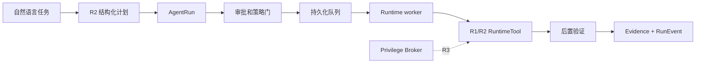

# 私人智能管家 Runtime V2：R0/R1 实施基线

本文档是 [ADR-0001](adr/0001-steward-execution-kernel.md) 的 R0/R1 运行与接口说明。R2 已在此内核上实现，见 [R2 用户态执行层](personal-ai-steward-runtime-r2.md)。

## 当前定位

Runtime V2 把系统从“任务记录”推进到“任务可执行状态机”，但 R1 只用确定性的 `runtime.echo` 验证内核。它已经解决的是执行可靠性，不是工具广度。



持久化状态机属于 R1；自然语言规划器、策略引擎和受限用户态系统工具属于 R2；虚线 Privilege Broker 仍属于 R3。

## 启用方式

默认关闭：

```powershell
$env:STEWARD_RUNTIME_V2 = 'true'
$env:STEWARD_RUNTIME_INTERVAL = '1s'
$env:STEWARD_RUNTIME_LIMIT = '10'
```

安装系统服务时可显式传入：

```powershell
go run ./cmd/steward service install --runtime-v2 --runtime-interval 1s --runtime-limit 10 --dry-run
```

已有服务也可通过既有的 `service env plan/apply` 流程设置这三个环境变量并重启。`STEWARD_RUNTIME_INTERVAL=0` 会保留 API 和数据，但停用自动 worker。

## 创建和执行 Run

R1 接收手工结构化计划：

```http
POST /api/steward/runs
Content-Type: application/json

{
  "goal": "验证执行内核",
  "idempotency_key": "demo-20260716-1",
  "permission_ceiling": "A0",
  "auto_start": true,
  "steps": [
    {
      "key": "echo",
      "title": "生成确定性结果",
      "tool_name": "runtime.echo",
      "arguments": {"value": "ok"},
      "expected_output": {"value": "ok"},
      "max_attempts": 2,
      "timeout_seconds": 10
    }
  ]
}
```

`auto_start=false` 创建 `draft`，需要调用 `POST /start`。任何步骤声明 `requires_approval=true` 时，自动启动会停在 `awaiting_approval`。

批准必须提交服务端返回的完整计划哈希：

```http
POST /api/steward/runs/{id}/approve
Content-Type: application/json

{
  "plan_hash": "<GET run 返回的 plan_hash>",
  "granted_by": "local-user",
  "scope": "run",
  "reason": "已检查步骤和权限上限"
}
```

计划哈希不一致返回 `409 Conflict`。批准过期后，尚未执行的受控步骤会重新停到 `awaiting_approval`。

## 事件流

`GET /api/steward/runs/{id}/events` 返回 SSE：

```text
id: 42
event: step.succeeded
data: {"sequence":42,"type":"step.succeeded",...}
```

客户端断线重连时可发送 `Last-Event-ID`，或使用 `?after=<sequence>`。终态 Run 的事件发送完毕后连接关闭；非终态连接会发送 keepalive。

## 可靠性语义

| 能力 | R1 行为 |
|---|---|
| 入队 | PostgreSQL 持久化，不依赖内存 channel |
| 领取 | `FOR UPDATE SKIP LOCKED`，同一 Run 只被一个 worker 领取 |
| 幂等 | HTTP 幂等键保护 Run；步骤和 invocation 有独立幂等键 |
| 重试 | 失败后在预算内回到 `queued`，每次 attempt 单独留痕 |
| 超时 | 每步 context deadline，范围 1–3600 秒 |
| 取消 | 未运行立即取消；运行中协作取消并在步骤边界确认 |
| 恢复 | R1 回放安全工具恢复到队列；R2 非幂等工具转为 `blocked`、撤销旧批准，禁止自动重放 |
| 验证 | Tool `Verify` 通过后 Step 才成功；全部 Step 成功后再验证 Run |
| 证据 | 工具输出/验证证据写入 `EvidenceArtifact`，事件写入只追加日志 |

## R0/R1 验收清单

- [x] 独立的执行实体和可重复迁移 schema。
- [x] V1 API、表和 Peer 协议面不变。
- [x] 手工多步骤计划、顺序依赖和不可变计划哈希。
- [x] draft、审批、队列、执行、验证和终态持久化。
- [x] Run 幂等冲突、步骤重试、超时、取消和恢复。
- [x] ToolSpec/ToolInvocation/ApprovalGrant/EvidenceArtifact/RunEvent 可查询。
- [x] SSE 支持断线续读。
- [x] 确定性工具覆盖成功、验证失败和重试测试路径。
- [x] 功能开关默认关闭，服务安装支持显式开启。

## R2 已落实的硬门槛

R2 可以实现自然语言规划器和低风险用户态工具，但必须遵守以下条件：

1. Planner 输出只能进入 `draft/planning`，不能直接绕过 policy gate 入队。
2. 每个新工具必须声明 schema、权限、风险、超时、取消、幂等和验证方式。
3. 写操作必须有目标范围和 preflight；“进程退出码为 0”不能作为唯一成功条件。
4. 可协调的 keyed 工具实现 reconcile；无法判断外部结果的非幂等工具必须阻断自动重放并要求新批准。
5. R2 只做当前用户权限；管理员/root 和凭据代理留给独立 R3 Broker。
6. 前端不得把 `queued/running` 显示成完成，必须以 `succeeded + evidence` 为准。
